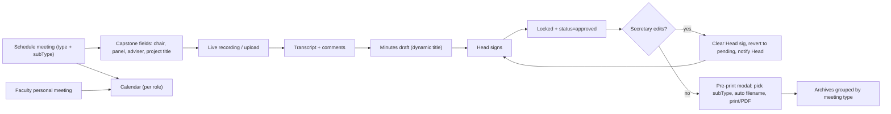

# SmartMin Capstone Feature Expansion

## Context

The base SmartMin demo (38 files, ~280 KB) is already in place at `c:\xampp\htdocs\SmartMin`. This plan adds the consolidated capstone-defense feature set you pasted, without breaking the existing flows. Constraints from your panel notes: **HTML, CSS, vanilla JS only; no database yet**. Locking behavior is `amend` (edit clears Head's signature and reverts to pending). Calendar is per-role.

## Decisions locked in

- **Lock workflow**: Head signature locks the minutes. Secretary may still edit, but on save the Head's signature is cleared, status reverts to `pending_approval`, the Head is re-notified, and an `minutes_amended` audit entry is written.
- **Calendar**: separate page per role, sharing one widget. Faculty calendar also overlays personal meetings.
- **Meeting taxonomy** (default; configurable in admin settings later):
  - `regular` — Faculty Senate, Department Sync, etc. (current behavior)
  - `capstone` with sub-types: `Title Proposal`, `Pre-Oral`, `Mock Defense`, `Final Presentation`, `Other`
  - `research` with sub-types: `Proposal`, `Progress`, `Final`
- **Profile**: name, position, optional photo (data URL). No age, no gender, anywhere.
- **UI terminology**: nav labels use inclusive role-neutral phrasing ("Meeting Schedule", "Live Recording", "Document Editor"). The role name remains only on the user identity chip.

## New data flow (high level)



## Files affected (cited)

**New files**
- `c:\xampp\htdocs\SmartMin\assets\js\calendar.js` — month/week grid widget
- `c:\xampp\htdocs\SmartMin\profile.html` — single page reused by every role
- `c:\xampp\htdocs\SmartMin\secretary\calendar.html`
- `c:\xampp\htdocs\SmartMin\head\calendar.html`
- `c:\xampp\htdocs\SmartMin\faculty\calendar.html`
- `c:\xampp\htdocs\SmartMin\faculty\personal-meetings.html`

**Modified files**
- [`assets/js/seed.js`](assets/js/seed.js) — extend schema, add 2 capstone meetings, activate cross-dept secretary `u_s2`
- [`assets/js/store.js`](assets/js/store.js) — new LS keys (`personalMeetings`, `comments`), helpers for lock/unlock/amend, photo persistence
- [`assets/js/shared.js`](assets/js/shared.js) — inclusive `NAV_LINKS` labels, add Calendar/Profile/Personal Meetings entries, render photo avatar in topbar/sidebar when present (`buildSidebar`/`buildTopbar` around lines 195-260)
- [`assets/js/summarizer.js`](assets/js/summarizer.js) — title generator helper `docTitleFor(meeting)`
- [`assets/css/theme.css`](assets/css/theme.css) — lock badge styles, amber amendment banner, calendar grid utilities, print refinements (hide `.lock-banner`, `.amend-banner`, `.comments-panel`)
- [`secretary/schedule.html`](secretary/schedule.html) — add type + subType selects, conditional Capstone fields (chair, panel multi-select, adviser, project title)
- [`secretary/mom-editor.html`](secretary/mom-editor.html) — dynamic title from `docTitleFor()`, Pre-Print modal, lock banner, comments section, Capstone meta header
- [`secretary/transcript.html`](secretary/transcript.html) — comments panel; comments persisted on `transcript.comments[]`
- [`secretary/archives.html`](secretary/archives.html) — folder grouping by `meetingType` + `subType`, auto filename
- [`secretary/live-recording.html`](secretary/live-recording.html) — surface project title + type in header
- [`head/approvals.html`](head/approvals.html) — write `lockedAt`/`lockedBy` on final sign; lock indicator
- [`head/dashboard.html`](head/dashboard.html) — surface pending re-approvals (amendments)
- [`head/reports.html`](head/reports.html) — Capstone summary section when present
- [`faculty/dashboard.html`](faculty/dashboard.html) — personal-meeting quick action, calendar tile
- [`faculty/my-meetings.html`](faculty/my-meetings.html) — type filter and badges
- [`faculty/transcript-view.html`](faculty/transcript-view.html) — read-only comments mirror
- [`admin/users.html`](admin/users.html) — explicit "Secretary for other department" UX hint; photo upload in modal
- [`admin/settings.html`](admin/settings.html) — meeting-type taxonomy editor (Capstone/Research subtypes)
- [`README.md`](README.md) — walkthrough updated

## Data model deltas

Stored in `localStorage` (no DB), all backwards-compatible (older records default to `meetingType: 'regular'`).

```text
meeting += {
  meetingType: 'regular' | 'capstone' | 'research',
  subType:    'Title Proposal' | 'Pre-Oral' | 'Mock Defense' | 'Final Presentation' | 'Proposal' | 'Progress' | 'Final' | 'Other' | '',
  projectTitle:    string,
  chairpersonId:   userId,
  panelMemberIds:  userId[],
  adviserId:       userId,
}

minutes += {
  lockedAt:   number | null,
  lockedBy:   userId  | null,
  amendments: [{ ts, byUserId, summary }],
  comments:   [{ id, ts, userId, name, text, parentId? }],
  documentTitle: string,   // dynamic; defaults to docTitleFor(meeting)
}

transcript += { comments: [...] }

user += { photoDataUrl: string }

personalMeetings: { id, userId, date, time, type, title, attendees, notes }
```

## Implementation order

The todos below mirror the natural sequence: foundation first, then features layered on top, then polish. Every change preserves the existing audit log, role scoping, and offline behavior.

## Out of scope (explicitly)

- Real DB persistence (panel said "no database yet")
- Server-side notifications / email (local toast + in-app notifications only)
- Real Whisper/LLaMA integration (continuing the canned + Web Speech fallback)
- Mobile-native shell (still responsive web)
- Multi-tenant SaaS controls

## Validation checkpoints

After each todo, smoke-test:
1. Sign in as Secretary → schedule a Capstone meeting with full panel → record → AI-extract → MoM uses dynamic title with project title visible
2. Sign in as Head → sign minutes → status flips to approved + locked
3. Sign in as Secretary → edit locked minutes → banner appears → save → status back to pending + Head notified
4. Open Faculty Calendar → personal meeting visible alongside department meetings
5. Print MoM → filename auto-includes Capstone project title and subType
6. Open Archives → tabs group meetings by type; clicking a Capstone Title Proposal opens correctly