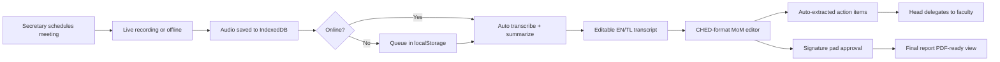

## Stack (locked)

- **HTML/CSS/JS only**, no build step, no database
- **Tailwind CDN** + custom theme config (deep maroon `#570000`, gold `#cba72f`, Public Sans + Inter, Material Symbols) — identical to your existing Stitch files in [smartmin_dashboard/code.html](StitchGoogle/stitch_smartmin_ai_intelligence_system/smartmin_dashboard/code.html)
- **Chart.js** (CDN) for admin statistics charts
- **MediaRecorder API** for audio capture, **IndexedDB** for blob storage, **localStorage** for app state (users, meetings, tasks, MoM, signatures, settings)
- **Web Speech API** (`SpeechRecognition`) for live in-browser transcription (`en-US` + `tl-PH`); falls back to canned demo transcript if unsupported
- Canned AI summarizer + Tagalog↔English translator (deterministic dictionary + sentence templates, runs offline)

## File structure (multi-page site)

```
SmartMin/
├── index.html                      // landing page (from smartmin_landing_page)
├── login.html                      // role-aware login (4 demo accounts)
├── register.html
├── forgot-password.html
├── assets/
│   ├── css/theme.css               // shared tailwind config + custom utilities (glass-panel, ched-doc, etc.)
│   ├── js/
│   │   ├── shared.js               // tailwind config, layout injection, auth guard, role router
│   │   ├── store.js                // localStorage + IndexedDB wrapper (users, meetings, tasks, audit)
│   │   ├── seed.js                 // demo data: 4 users, 6 departments, 8 meetings, tasks, transcripts
│   │   ├── recorder.js             // MediaRecorder + offline queue + auto-upload simulation
│   │   ├── transcriber.js          // Web Speech API wrapper + canned fallback + EN/TL toggle
│   │   ├── translator.js           // EN↔TL dictionary+template translator
│   │   ├── summarizer.js           // extractive summary + action-item extractor (regex/heuristic)
│   │   ├── signature.js            // canvas signature pad
│   │   └── charts.js               // Chart.js dashboards for admin
│   └── partials/
│       ├── sidebar.html            // role-filtered nav, injected by shared.js
│       └── topbar.html
├── admin/
│   ├── dashboard.html              // stat cards + 4 charts + system health + recent activity
│   ├── users.html                  // CRUD across all roles, filter by role/department
│   ├── departments.html            // institutional / department / office management
│   ├── meetings.html               // all meetings across institution
│   ├── audit.html                  // privacy + audit trail, access logs, retention controls
│   └── settings.html               // AI model toggles, privacy, branding
├── head/                           // President / Department Head
│   ├── dashboard.html              // their department only
│   ├── approvals.html              // approve & sign MoM, reports
│   ├── delegate.html               // task delegation board
│   └── reports.html
├── secretary/
│   ├── dashboard.html
│   ├── schedule.html               // meeting management (create/edit)
│   ├── live-recording.html
│   ├── upload-audio.html
│   ├── transcript.html             // transcript editor + EN/TL toggle
│   ├── mom-editor.html             // CHED-format MoM editor with AI summary
│   └── archives.html
└── faculty/
    ├── dashboard.html              // assigned tasks + my meetings
    ├── my-tasks.html
    ├── my-meetings.html
    └── transcript-view.html        // read-only transcript + summary
```

## Role-based access (no backend)

`shared.js` reads `localStorage.currentUser` and:
- redirects to `login.html` if absent
- redirects to wrong-role pages back to that role's dashboard
- injects the **role-filtered sidebar** so Faculty never sees Admin links

Four seeded demo accounts (shown on login page):

- `admin@zppsu.edu.ph` / `admin123` → System Administrator
- `president@zppsu.edu.ph` / `head123` → College Dean / Head
- `secretary@zppsu.edu.ph` / `sec123` → Faculty Secretary
- `faculty@zppsu.edu.ph` / `fac123` → Faculty Member

Admin sees **merged/fetched-all** view (every department, every meeting, every user); other roles see only their scoped slice — implemented as a `scopeFor(user)` filter in `store.js`.

## Admin dashboard (the rich one)

Built on the Tailwind theme (no Bootstrap mixing), but with the AdminLTE-style density you wanted:

- **4 KPI stat cards**: Active Users, Meetings This Month, AI Hours Saved, Pending Approvals
- **4 Chart.js charts**: Meetings/Month (line), Tasks by Status (doughnut), Users by Role (bar), AI Accuracy Trend (area)
- **System Health panel**: Whisper/LLaMA model status, CPU/GPU usage bars (animated mock)
- **Recent Activity feed** + **User Management table** + **Quick Actions** (matches [smartmin_admin_panel/code.html](StitchGoogle/stitch_smartmin_ai_intelligence_system/smartmin_admin_panel/code.html))

## Meeting lifecycle (end-to-end demo flow)



## Feature mapping (what gets built, citing your refs)

- **Offline recording + auto-upload**: `recorder.js` uses `MediaRecorder` → stores chunks in IndexedDB; on `online` event replays queued items through the summarizer pipeline and shows toast "Synced 2 offline recordings"
- **Transcription EN + Tagalog**: language picker on `secretary/live-recording.html` (extends [smartmin_live_recording/code.html](StitchGoogle/stitch_smartmin_ai_intelligence_system/smartmin_live_recording/code.html)); Web Speech API with `lang = 'en-US'` or `'tl-PH'`
- **Translator**: button in transcript editor toggles EN↔TL using `translator.js` (200-term institutional dictionary + sentence-frame templates — good enough for demo)
- **Summarization**: `summarizer.js` runs extractive summary (top-N sentences by keyword/positional score) + regex action-item extraction (`/will|shall|to-do|action:|deadline/i`)
- **CHED-format MoM**: reuse [smartmin_ched_style_minutes/code.html](StitchGoogle/stitch_smartmin_ai_intelligence_system/smartmin_ched_style_minutes/code.html) verbatim, wire its fields to live meeting data
- **Task delegation**: head/delegate.html — kanban with drag-drop (HTML5 DnD), assign to faculty, deadline picker
- **Reports with signature**: `signature.js` renders a canvas signature pad inside the MoM doc; saved as data-URL, stamped onto report; PDF export via `window.print()` with print stylesheet
- **Institutional / Department / Office mgmt**: `admin/departments.html` — CRUD for ZPPSU colleges (CICS, CET, CBA, CTE, COE) and offices
- **Privacy**: `admin/audit.html` — every action logged in `localStorage.auditLog` (who, what, when, IP-placeholder); retention slider; data-export & local-wipe buttons; "Local Processing" badge per the [DESIGN.md](StitchGoogle/stitch_smartmin_ai_intelligence_system/institutional_intelligence/DESIGN.md) AI badge spec

## Visual consistency

Every page imports the same `assets/css/theme.css` and `shared.js` so the tailwind config block isn't duplicated 18 times like in your current Stitch files. Sidebar/topbar are **single source of truth** loaded via `fetch('/assets/partials/sidebar.html')` so changing one updates all pages.