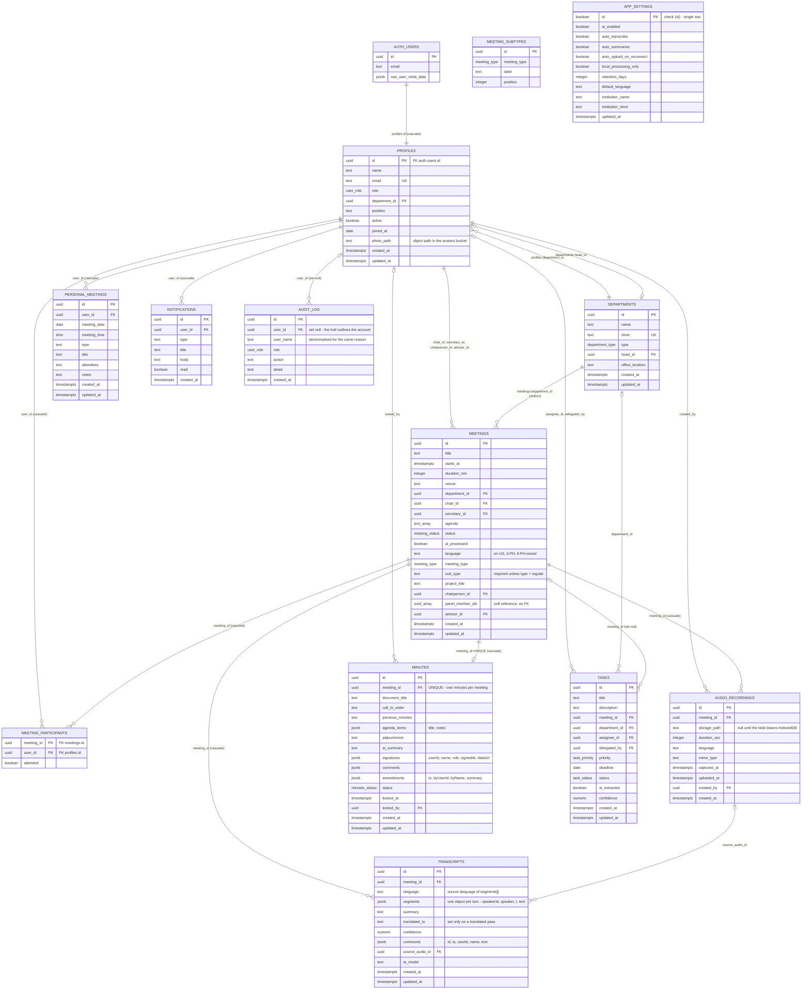

# SmartMin entity–relationship diagram

Reflects `supabase/migrations/0001_schema.sql` (tables, keys, FKs). The
migrations are the authoritative schema; this file is the readable view of them.
If they disagree, the migration wins.

## Diagram



`MEETING_SUBTYPES` and `APP_SETTINGS` carry no foreign keys, so they float free of
the diagram's edges: sub-types are keyed by the `meeting_type` enum value rather
than by a row, and `app_settings` is a one-row table pinned by
`check (id)`.

## Enums

| Enum | Values |
|---|---|
| `user_role` | `admin`, `head`, `secretary`, `faculty` |
| `department_type` | `college`, `office` |
| `meeting_type` | `regular`, `capstone`, `research` |
| `meeting_status` | `scheduled`, `recording`, `transcribed`, `pending_approval`, `approved`, `archived` |
| `minutes_status` | `draft`, `pending_approval`, `approved` |
| `task_status` | `pending`, `in_progress`, `done` |
| `task_priority` | `low`, `medium`, `high` |

## Delete behaviour worth remembering

- Deleting an `auth.users` row cascades to its `profiles` row, and from there to
  that person's `meeting_participants`, `personal_meetings` and `notifications`.
- Deleting a meeting cascades to its participants, audio recordings, transcripts
  and minutes — but only nulls `tasks.meeting_id`, because an action item can
  outlive the meeting that produced it.
- `meetings.department_id` is `on delete restrict`: a department with meetings
  cannot be deleted out from under them.
- `audit_log.user_id` is `on delete set null` and `user_name` is denormalised, so
  the trail survives account deletion.

## What the diagram does not show

Row-level security. Every table has RLS enabled in `0002_rls.sql`, and meeting
visibility lives in exactly one function, `sm_can_see_meeting()`, which
`meetings`, `meeting_participants`, `transcripts`, `minutes`,
`audio_recordings` and the `meeting-audio` storage policies all call. Read the
FK graph as "what can reference what", not as "who can read what".

---

# Multilingual transcripts (English / Tagalog / Taglish)

Walang schema change na kailangan — the columns already carry this. Ang mahalaga
ay kung saan mo isusulat ang bawat piraso.

## 1. `meetings.language` — the mode of the meeting

This is the switch the app reads, not decoration. Values in use:

| Value | Meaning |
|---|---|
| `en-US` | English meeting |
| `tl-PH` | Tagalog/Filipino meeting |
| `tl-PH-mixed` | Taglish — halo ang English at Tagalog sa iisang pulong |

`src/lib/ai/prompts.ts` tests `meeting.language?.startsWith('tl')`. Anything
starting with `tl` tells Claude that the transcript is partly or wholly in
Filipino, and that the minutes must come out in English while preserving
Filipino terms that have no accurate English equivalent (`pakiusap`,
`bayanihan`, `barangay`-level references, and so on).

**Kaya `tl-PH-mixed` ang gamitin para sa Taglish, hindi plain `mixed`.** A bare
`mixed` does not start with `tl`, so the Filipino instruction never reaches the
prompt and the model treats the meeting as English-only. Same trap with `fil-PH`
— walang `tl` prefix, so it silently loses the guidance.

## 2. `transcripts.segments[].text` — the actual dialogue

Store the speech verbatim, exactly as spoken. Hindi kailangang i-translate,
hindi rin kailangang paghiwalayin ang English at Tagalog na sentences. One
segment per turn:

```json
[
  {
    "speakerId": "…uuid…",
    "speaker": "Engr. Ricardo Gomez",
    "t": 0,
    "text": "Good morning, everyone. Magsisimula na tayo — kumpleto na ang quorum."
  },
  {
    "speakerId": "…uuid…",
    "speaker": "Sarah Torres",
    "t": 24,
    "text": "Sir, ang minutes po ng June 20 meeting ay naipamahagi na. May I move for their approval?"
  }
]
```

`t` is the offset in seconds from the start of the recording, so the transcript
pane can seek the audio. Taglish within a single sentence is fine and expected —
huwag itong linisin, that is the record.

## 3. `transcripts.language` — the source language of those segments

Mirror the meeting mode (`tl-PH-mixed` for Taglish). Ito ang sinasabi kung anong
wika ang nasa `segments[]` **ngayon**, not what you wish it were.

## 4. `transcripts.translated_to` — only on a translated pass

Kapag gumawa ka ng English rendering ng isang Tagalog transcript, that is a
**second row** in `transcripts` for the same `meeting_id`:

| Column | Source pass | Translated pass |
|---|---|---|
| `language` | `tl-PH-mixed` | `tl-PH-mixed` — still the *source* language |
| `translated_to` | `null` | `en-US` |
| `segments[].text` | verbatim Taglish | English rendering |
| `ai_model` | e.g. `web-speech` | the translating model |

Never overwrite the original in place. `transcripts.meeting_id` has no unique
constraint precisely so both passes can coexist; the verbatim pass is the
evidentiary record and the translation is derived from it. Kung ma-overwrite mo
ang original, wala ka nang mababalikan.

## 5. `audio_recordings.language`

Whatever locale the browser's speech recogniser was set to when the audio was
captured. It describes the capture, not the interpretation, so it can differ
from `meetings.language` — a recorder left on `en-US` during a Taglish meeting
is exactly the case worth being able to see afterwards.

## Quick checklist

- Taglish meeting → `meetings.language = 'tl-PH-mixed'` (never plain `mixed`).
- Verbatim speech → `transcripts.segments[].text`, walang paglilinis.
- `transcripts.language` = source language, always.
- Translation → new `transcripts` row with `translated_to` set, original kept.
- Minutes come out in English regardless; the prompt handles that.
